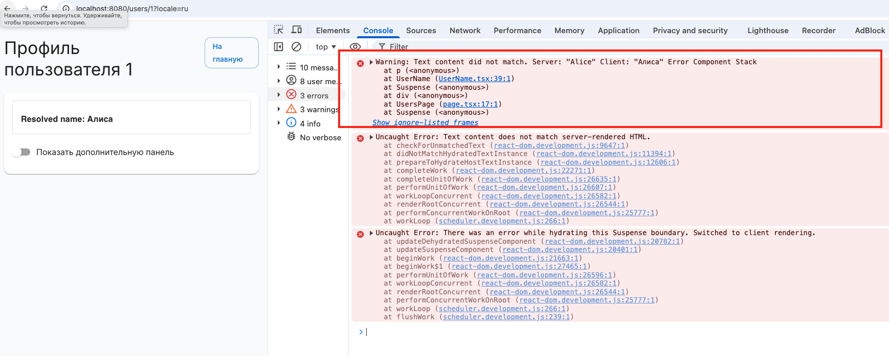

# Modern JS Test Task

## Требования

- Node.js v20.19.0
- Yarn (berry/modern-js)

## Быстрый старт

```bash
yarn setup
yarn dev
```

## Описание.

Дано приложение, состоящие из хоста и микрофронтенда. Реализовано с помощью `Modern.js` + `ssr` + `Module Federation`.
На странице пользователя выводятся данные о пользователе.
Данные о пользователе на странице выводятся в нескольких местах (панель дополнительной информации открывается по свичу).
Выводится английский или русский вариант имени:

- http://localhost:8080/users/1   - выводится английский вариант имени по умолчанию
- http://localhost:8080/users/1?locale=en - выводится английский вариант имени
- http://localhost:8080/users/1?locale=ru - выводится русский вариант имени

На странице профиля замечено некорректное поведение. Как можно воcпроизвести:

- запустить приложение, открыть главную страницу http://localhost:8080
- перейти на англоязычный вариант профиля 
- скопировать роут, ввести в соседней вкладке, перед этим изменив в ручную locale на 'ru' - отобразится русский вариант имени - как и должно
- если снова вернуться на предыдущую вкладку и ее перезагрузить, то там сначала отобразится русскоязычное имя несмотря на locale в роуте, а затем будет warning в консоли:




## Задача.

- Найти и объяснить причину бага.
- Придумать способ устранения бага и его реализовать. 

При этом должно сохраниться функциональное требование к странице профиля:

- в рамках одного роута (то есть при одно id пользователя и локале) должна сохраняться 
оптимизация запросов о данных пользователя (кеширование) - то есть если мы уже получили данные для верхнего компонента, то при открытии дополнительной панели данные не должны по новой подгружаться.

## Объяснение бага.

Изначально UserClient был один на весь Node-процесс и кешировал значения в Map, где ключом служил только userId. То есть locale в ключ не входила, поэтому первый запрос /users/1?locale=ru складывал в кеш «Алиса», и следующий запрос /users/1?locale=en видел ту же запись и возвращал русский вариант, хотя должен был взять английский. Поскольку синглтон жил между запросами, кеш «протекал» от одного пользователя к другому, а отсутствие locale в ключе делало утечку очевидной.

## Вариант решения через корректные ключи

1. В `remote/src/lib/userClient.ts` кеш и карта промисов используют ключ `${userId}:${locale}`, поэтому разные локали больше не затирают друг друга.
2. Остальная логика (singleton, Suspense-кеш в компонентах) остаётся прежней, но теперь даже процессный клиент возвращает корректные данные для каждого языка.

_____

РЕШЕНИЕ РАБОЧЕЕ, но у текущей реализации есть изначально недостатки:

- Singleton всё равно процессный: любое новое условие (A/B флаги, theme, preview, authorization) снова придётся добавлять в ключ, иначе данные утекут.
- Кеш растёт бессрочно. Каждый userId:locale остаётся в памяти до перезапуска процесса, значит при большом трафике — риск утечки памяти, придётся городить TTL/LRU (пояснение ниже).
- При код-ревью сложнее понять, что конкретно надо добавить в ключ: список параметров со временем расползётся, легко пропустить новый.
- Нет изоляции между пользователями: хоть мы и различаем локаль, сам UserClient по‑прежнему делит state на весь процесс, что не соответствует best practice для SSR.
То есть это временный фикс: работает, пока требования простые, но масштабировать и сопровождать сложно.

----
Если кандидат осознанно выбрал «ключевое» решение и явно обозначил его минусы (рост кеша, зависимость от конкретных параметров, риск забыть другой контекст), это показывает понимание проблемы. Такое решение можно принять как компромисс, особенно если он дополнительно описал, как перейти на request-scoped фабрику в дальнейшем. Главное, чтобы недостатки были озвучены.

## Вариант решения через Фабрику

1. **Фабрика вместо синглтона.** `remote/src/lib/userClient.ts` экспортирует `createUserClient`, а `remote/UserClientProvider` создаёт экземпляр на каждый SSR/CSR‑рендер и кладёт его в контекст. Кеш живёт только в рамках запроса.
2. **Кеш и Suspense внутри клиента.** `UserClient` хранит и значения, и промисы (`pending`). `readUserName` просто читает кеш через `peekUserName` или бросает `getUserName(client, ...)`, поэтому повторные рендеры не уходят в сеть.
3. **Host оборачивает remote‑виджеты провайдером.** На странице `host/src/routes/users/[id]/page.tsx` и основной блок, и дополнительная панель находятся внутри `remote/UserClientProvider`, поэтому делят один request-scoped клиент, а соседние HTTP‑запросы получают свежие инстансы.

____
Для кандидата middle+/senior переход на фабрику с request-scoped клиентом — прогноз времени примерно на 1–2 часа, если он понимает, почему синглтон в SSR опасен и как работает Suspense/MF. 
То есть в условия нескольких задач на интервью самый быстрый вариант, чтобы всё успеть - пофиксить с
помощью ключей, но при этом отметить недостатки такой реализации.

## Пояснения
TTL (Time To Live) — время жизни записи. После истечения заданного интервала (например, 5 минут) запись считается устаревшей и при следующем обращении удаляется или перезаписывается. Это простой способ ограничить рост кеша.

LRU (Least Recently Used) — стратегия “самое давно неиспользованное выкидываем”. Кеш хранит фиксированное число записей; когда приходит новая, самая “старшая” по времени доступа запись удаляется. Это экономит память, но требует дополнительной логики для отслеживания порядков.

Обе техники нужны, чтобы process-wide кеш не рос бесконтрольно.
